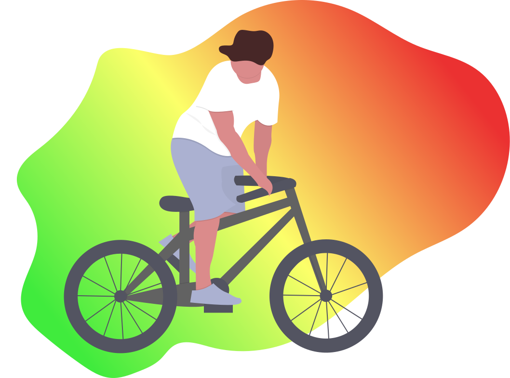

<!-- AUTO-GENERATED-CONTENT:START (STARTER) -->

  

<h1 align="center">
  SVG of person on bike
</h1>

Found image on: https://undraw.co/.
Used Figma to edit and style image and exported it as SVG for free: https://www.figma.com/file/dfb2OylW3on6JtJZ15rwk6/Untitled?node-id=0%3A1

## 🚀 Simple SVG of a Bike person

## 💫 Deploy

<!-- AUTO-GENERATED-CONTENT:END -->
